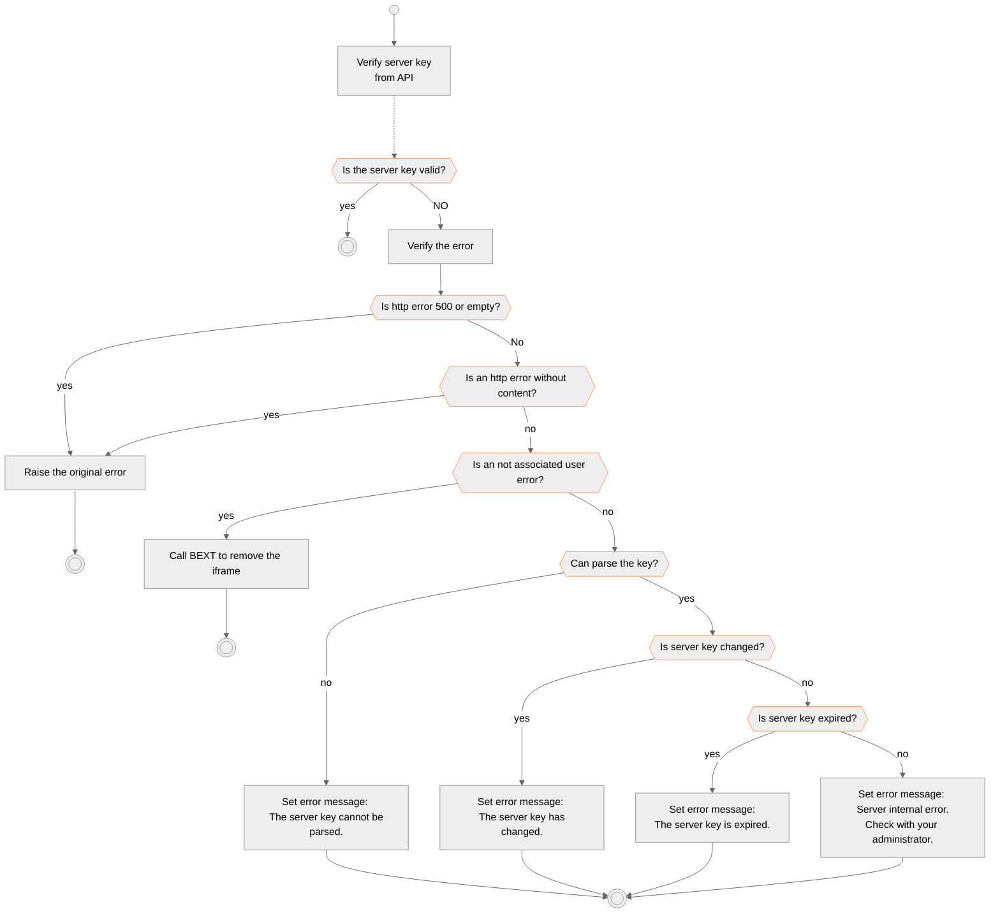

```mermaid
%%{init: {'theme':'neutral'}}%%
graph TB
classDef condition stroke:#f96
classDef requirement stroke:#b30900
START(( ))

API_VSK[Verify server key<br>from API]
THROW_ERROR[Raise the original error]
IS_SK_VALID{{Is the server key valid?}}:::condition
CHECK_ERROR[Verify the error]
IS_HTTP_ERROR_500{{Is http error 500 or empty?}}:::condition
IS_HTTP_ERROR_NO_CONTENT{{Is an http error without content?}}:::condition
IS_NO_ASSOCIATED_USER{{Is an not associated user error?}}:::condition
REMOVE_BEXT_IFRAME[Call BEXT to remove the iframe]
CAN_PARSE_KEY{{Can parse the key?}}:::condition
IS_KEY_CHANGED{{Is server key changed?}}:::condition
IS_KEY_EXPIRED{{Is server key expired?}}:::condition
SET_CANNOT_PARSE_KEY_MESSAGE[Set error message: </br> The server key cannot be parsed.]
SET_KEY_HAS_CHANGED_MESSAGE[Set error message: </br> The server key has changed.]
SET_KEY_IS_EXPIRED_MESSAGE[Set error message: </br> The server key is expired.]
SET_GENERIC_ERROR_MESSAGE[Set error message: </br> Server internal error. Check with your administrator.]

START --> API_VSK
API_VSK -..-> IS_SK_VALID
IS_SK_VALID --> |yes|END((( )))
IS_SK_VALID --> |NO|CHECK_ERROR
CHECK_ERROR --> IS_HTTP_ERROR_500
IS_HTTP_ERROR_500 --> |yes|THROW_ERROR
IS_HTTP_ERROR_500 --> |No|IS_HTTP_ERROR_NO_CONTENT
IS_HTTP_ERROR_NO_CONTENT --> |yes|THROW_ERROR
THROW_ERROR --> ENDWITHERROR((( )))
IS_HTTP_ERROR_NO_CONTENT --> |no|IS_NO_ASSOCIATED_USER
IS_NO_ASSOCIATED_USER--> |yes|REMOVE_BEXT_IFRAME
REMOVE_BEXT_IFRAME --> ENDBYCALLINGBEXT((( )))
IS_NO_ASSOCIATED_USER--> |no|CAN_PARSE_KEY
CAN_PARSE_KEY--> |no|SET_CANNOT_PARSE_KEY_MESSAGE
SET_CANNOT_PARSE_KEY_MESSAGE --> ENDCUSTOMMESSAGEERROR((( )))
CAN_PARSE_KEY--> |yes|IS_KEY_CHANGED
IS_KEY_CHANGED--> |yes|SET_KEY_HAS_CHANGED_MESSAGE
SET_KEY_HAS_CHANGED_MESSAGE--> ENDCUSTOMMESSAGEERROR((( )))
IS_KEY_CHANGED--> |no|IS_KEY_EXPIRED
IS_KEY_EXPIRED--> |yes|SET_KEY_IS_EXPIRED_MESSAGE
SET_KEY_IS_EXPIRED_MESSAGE --> ENDCUSTOMMESSAGEERROR((( )))
IS_KEY_EXPIRED--> |no|SET_GENERIC_ERROR_MESSAGE
SET_GENERIC_ERROR_MESSAGE--> ENDCUSTOMMESSAGEERROR((( )))
```