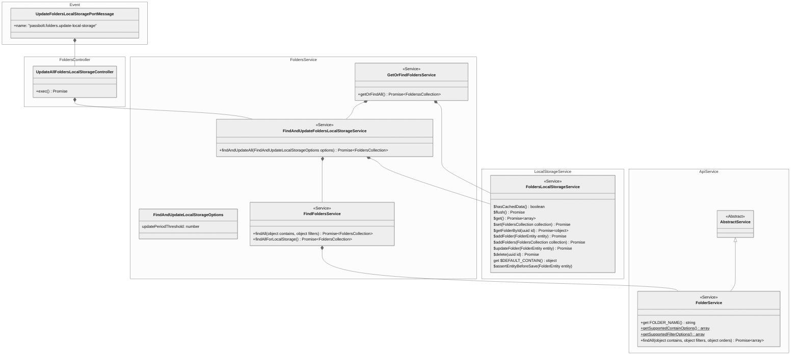

```mermaid
%%{init: {'theme':'neutral'}}%%
classDiagram
    namespace Event {
        class UpdateFoldersLocalStoragePortMessage{
            +name: "passbolt.folders.update-local-storage"
        }
    }

    namespace FoldersController {
        class UpdateAllFoldersLocalStorageController{
            +exec() Promise
        }
    }

    namespace FoldersService{
        class GetOrFindFoldersService{
            <<Service>>
            +getOrFindAll() Promise~FolderssCollection~
        }

        class FindAndUpdateFoldersLocalStorageService{
            <<Service>>
            +findAndUpdateAll(FindAndUpdateLocalStorageOptions options) Promise~FoldersCollection~
        }

        class FindAndUpdateLocalStorageOptions {
            updatePeriodThreshold: number
        }

        class FindFoldersService{
            <<Service>>
            +findAll(object contains, object filters) Promise~FoldersCollection~
            +findAllForLocalStorage() Promise~FoldersCollection~
        }
    }

    namespace ApiService{
        class AbstractService {
            <<Abstract>>
        }

        class FolderService {
            <<Service>>
            +get FOLDER_NAME() string
            +getSupportedContainOptions() array$
            +getSupportedFilterOptions() array$
            +findAll(object contains, object filters, object orders) Promise~array~
        }
    }

    namespace LocalStorageService{
        class FoldersLocalStorageService {
            <<Service>>
            $hasCachedData() boolean
            $flush() Promise
            $get() Promise~array~
            $set(FoldersCollection collection) Promise
            $getFolderById(uuid id) Promise~object~
            $addFolder(FolderEntity entity) Promise
            $addFolders(FoldersCollection collection) Promise
            $updateFolder(FolderEntity entity) Promise
            $delete(uuid id) Promise
            get $DEFAULT_CONTAIN() object
            $assertEntityBeforeSave(FolderEntity entity)
        }
    }

    UpdateFoldersLocalStoragePortMessage*--UpdateAllFoldersLocalStorageController
    UpdateAllFoldersLocalStorageController*--FindAndUpdateFoldersLocalStorageService
    FindAndUpdateFoldersLocalStorageService*--FoldersLocalStorageService
    GetOrFindFoldersService*--FoldersLocalStorageService
    GetOrFindFoldersService*--FindAndUpdateFoldersLocalStorageService
    FindAndUpdateFoldersLocalStorageService*--FindFoldersService
    FindFoldersService*--FolderService
    AbstractService<|--FolderService
```
