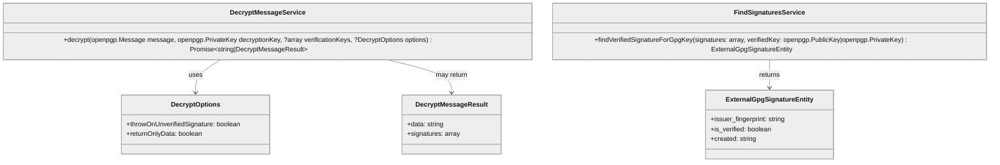

```mermaid
%%{init: {'theme':'neutral'}}%%
classDiagram
	class DecryptMessageService {
    	+decrypt(openpgp.Message message, openpgp.PrivateKey decryptionKey, ?array<openpgp.PublicKey|openpgp.PrivateKey> verificationKeys, ?DecryptOptions options) Promise~string|DecryptMessageResult~
	}
	class DecryptOptions {
    	+throwOnUnverifiedSignature: boolean
    	+returnOnlyData: boolean
	}
	class DecryptMessageResult {
    	+data: string
    	+signatures: array<openpgp.Signature>
	}
	class FindSignaturesService {
    	+findVerifiedSignatureForGpgKey(signatures: array<openpgp.VerificationResult>, verifiedKey: openpgp.PublicKey|openpgp.PrivateKey) ExternalGpgSignatureEntity
	}
	class ExternalGpgSignatureEntity {
    	+issuer_fingerprint: string
    	+is_verified: boolean
    	+created: string
	}
	DecryptMessageService --> DecryptOptions : uses
	DecryptMessageService --> DecryptMessageResult : may return
	FindSignaturesService --> ExternalGpgSignatureEntity : returns
```
