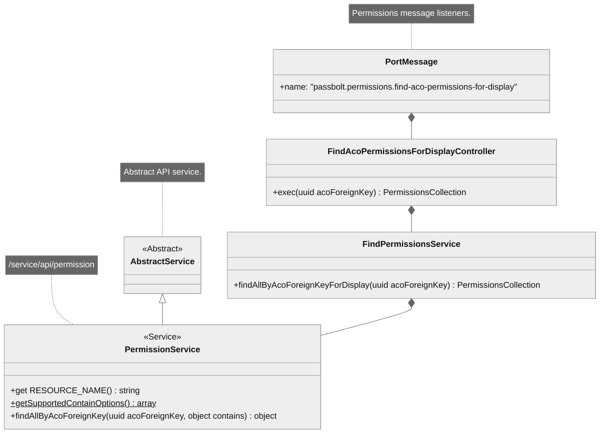

```mermaid
%%{init: {'theme':'neutral'}}%%
classDiagram
    note for PortMessage "Permissions message listeners."
    class PortMessage{
        +name: "passbolt.permissions.find-aco-permissions-for-display"
    }

    class FindAcoPermissionsForDisplayController{
        +exec(uuid acoForeignKey) PermissionsCollection
    }

    class FindPermissionsService{
        +findAllByAcoForeignKeyForDisplay(uuid acoForeignKey) PermissionsCollection
    }

    note for PermissionService "/service/api/permission"
    class PermissionService {
        <<Service>>
        +get RESOURCE_NAME() string
        +getSupportedContainOptions() array$
        +findAllByAcoForeignKey(uuid acoForeignKey, object contains) object
    }

    note for AbstractService "Abstract API service."
    class AbstractService {
        <<Abstract>>
    }

    AbstractService<|--PermissionService
    FindPermissionsService*--PermissionService
    FindAcoPermissionsForDisplayController*--FindPermissionsService
    PortMessage*--FindAcoPermissionsForDisplayController
```
