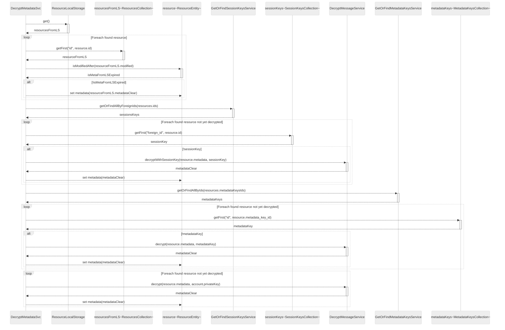

```mermaid
%%{init: {'theme':'neutral'}}%%
sequenceDiagram

%% Retrieve resources from LS
DecryptMetadataSvc-->>+ResourceLocalStorage: get()
ResourceLocalStorage-->>-DecryptMetadataSvc: resourcesFromLS

%% Reuse metadata from LS whenever possible
loop Foreach found resource
    DecryptMetadataSvc-->>+resourcesFromLS~ResourcesCollection~: getFirst("id", resource.id)
    resourcesFromLS~ResourcesCollection~-->>-DecryptMetadataSvc: resourceFromLS
    DecryptMetadataSvc-->>+resource~ResourceEntity~: isModifiedAfter(resourceFromLS.modified)
    resource~ResourceEntity~-->>-DecryptMetadataSvc: isMetaFromLSExpired
    alt !isMetaFromLSExpired
        DecryptMetadataSvc-->>resource~ResourceEntity~: set metadata(resourceFromLS.metadataClear)
    end
end

%% Decrypt metadata with session key whenever possible
DecryptMetadataSvc-->>+GetOrFindSessionKeysService: getOrFindAllByForeignIds(resources.ids)
GetOrFindSessionKeysService-->>-DecryptMetadataSvc: sessionsKeys
loop Foreach found resource not yet decrypted
    DecryptMetadataSvc-->>+sessionKeys~SessionKeysCollection~: getFirst("foreign_id", resource.id)
    sessionKeys~SessionKeysCollection~-->>-DecryptMetadataSvc: sessionKey
    alt !sessionKey
        DecryptMetadataSvc-->>+DecryptMessageService: decryptWithSessionKey(resource.metadata, sessionKey)
        DecryptMessageService-->>-DecryptMetadataSvc: metadataClear
        DecryptMetadataSvc-->>resource~ResourceEntity~: set metadata(metadataClear)
    end
end

%% Decrypt with meta key whenever possible
DecryptMetadataSvc-->>+GetOrFindMetadataKeysService: getOrFindAllByIds(resources.metadataKeysIds)
GetOrFindMetadataKeysService-->>-DecryptMetadataSvc: metadataKeys
loop Foreach found resource not yet decrypted
    DecryptMetadataSvc-->>+metadataKeys~MetadataKeysCollection~: getFirst("id", resource.metadata_key_id)
    metadataKeys~MetadataKeysCollection~-->>-DecryptMetadataSvc: metadataKey
    alt !metadataKey
        DecryptMetadataSvc-->>+DecryptMessageService: decrypt(resource.metadata, metadataKey)
        DecryptMessageService-->>-DecryptMetadataSvc: metadataClear
        DecryptMetadataSvc-->>resource~ResourceEntity~: set metadata(metadataClear)
    end
end

loop Foreach found resource not yet decrypted
    DecryptMetadataSvc-->>+DecryptMessageService: decrypt(resource.metadata, account.privateKey)
    DecryptMessageService-->>-DecryptMetadataSvc: metadataClear
    DecryptMetadataSvc-->>resource~ResourceEntity~: set metadata(metadataClear)
end
```