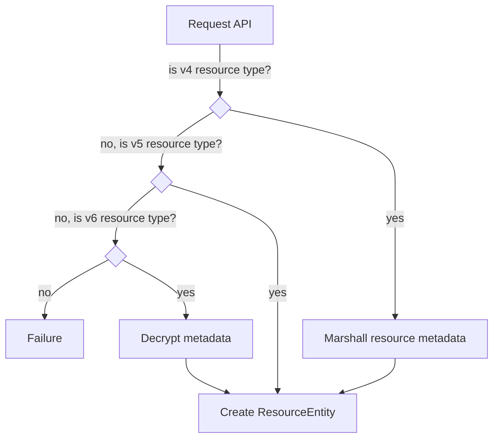

```mermaid
graph
    A[Request API]
    B[Marshall resource metadata]
    C[Create ResourceEntity]
    D[Failure]
    E[Decrypt metadata]
    C1{ }
    C2{ }
    C3{ }
    A --> |is v4 resource type?| C1
    C1 --> |no, is v5 resource type?| C2
    C1 --> |yes| B
    B --> C
    C2 --> |no, is v6 resource type?| C3
    C2 --> |yes| C
    C3 --> |no| D
    C3 --> |yes| E
    E --> C
```
