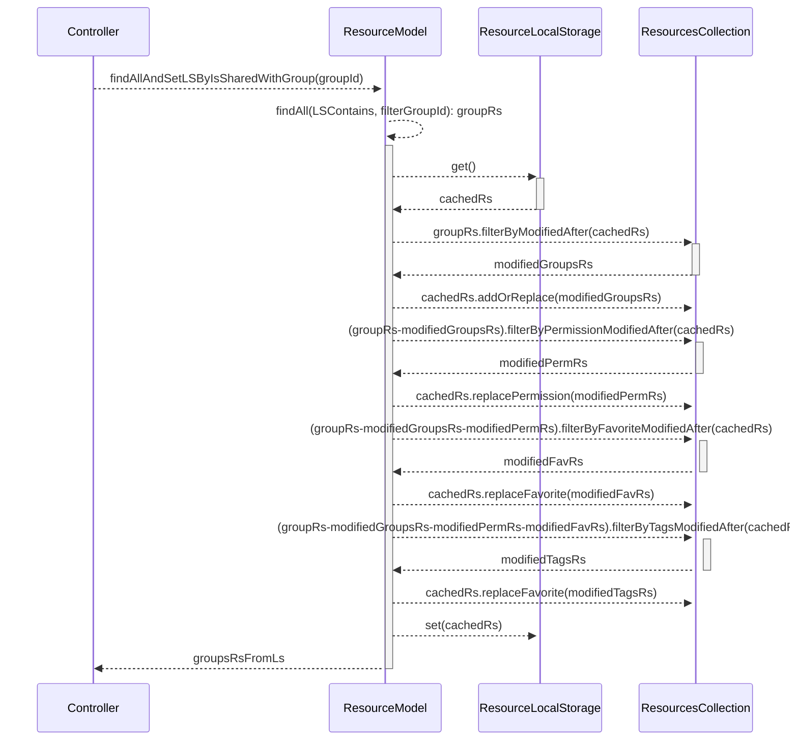

```mermaid
%%--{init: {'theme':'neutral'}}%%
sequenceDiagram
Controller-->>+ResourceModel: findAllAndSetLSByIsSharedWithGroup(groupId)
ResourceModel-->>+ResourceModel: findAll(LSContains, filterGroupId): groupRs
ResourceModel-->>+ResourceLocalStorage: get()
ResourceLocalStorage-->>-ResourceModel: cachedRs
ResourceModel-->>+ResourcesCollection: groupRs.filterByModifiedAfter(cachedRs)
ResourcesCollection-->>-ResourceModel: modifiedGroupsRs
ResourceModel-->>+ResourcesCollection: cachedRs.addOrReplace(modifiedGroupsRs)
ResourceModel-->>+ResourcesCollection: (groupRs-modifiedGroupsRs).filterByPermissionModifiedAfter(cachedRs)
ResourcesCollection-->>-ResourceModel: modifiedPermRs
ResourceModel-->>+ResourcesCollection: cachedRs.replacePermission(modifiedPermRs)
ResourceModel-->>+ResourcesCollection: (groupRs-modifiedGroupsRs-modifiedPermRs).filterByFavoriteModifiedAfter(cachedRs)
ResourcesCollection-->>-ResourceModel: modifiedFavRs
ResourceModel-->>+ResourcesCollection: cachedRs.replaceFavorite(modifiedFavRs)
ResourceModel-->>+ResourcesCollection: (groupRs-modifiedGroupsRs-modifiedPermRs-modifiedFavRs).filterByTagsModifiedAfter(cachedRs)
ResourcesCollection-->>-ResourceModel: modifiedTagsRs
ResourceModel-->>+ResourcesCollection: cachedRs.replaceFavorite(modifiedTagsRs)
ResourceModel-->>+ResourceLocalStorage: set(cachedRs)
ResourceModel-->>-Controller: groupsRsFromLs
```