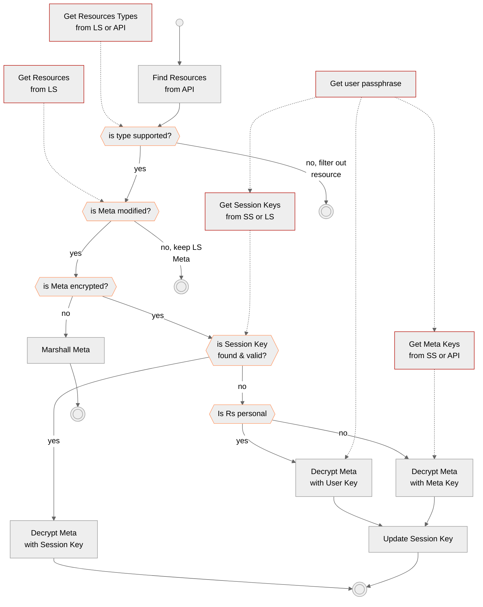

```mermaid
%%{init: {'theme':'neutral'}}%%
graph TB
classDef condition stroke:#f96
classDef requirement stroke:#b30900
START(( ))
API_RS[Find Resources<br>from API]
LS_API_RST[Get Resources Types<br>from LS or API]:::requirement
IS_RST_SUP{{is type supported?}}:::condition
LS_RS[Get Resources<br>from LS]:::requirement
V4_MARSH[Marshall Meta]
SS_LS_SESS_KEYS[Get Session Keys<br>from SS or LS]:::requirement
V4_MARSH[Marshall Meta]
DEC_META_SESS_KEY[Decrypt Meta <br>with Session Key]
DEC_META_USER_KEY[Decrypt Meta <br>with User Key]
SS_API_META_KEY[Get Meta Keys<br>from SS or API]:::requirement
DEC_META_META_KEY[Decrypt Meta <br>with Meta Key]
GET_PASSPHRASE[Get user passphrase]:::requirement
UPDATE_SESS_KEY[Update Session Key]
EHD_META_DECRYPTED((( )))
IS_META_UPDATED{{is Meta modified?}}:::condition
IS_META_ENCRYPTED{{is Meta encrypted?}}:::condition
IS_SESS_KEY_FOUND{{is Session Key<br>found & valid?}}:::condition
IS_RS_PERSO{{Is Rs personal}}:::condition
START --> API_RS
LS_API_RST -..-> IS_RST_SUP
API_RS --> IS_RST_SUP
IS_RST_SUP --> |no, filter out<br>resource|END_FILTER_OUT((( )))
LS_RS -..-> IS_META_UPDATED
IS_RST_SUP --> |yes|IS_META_UPDATED
IS_META_UPDATED --> |no, keep LS<br>Meta|END_META_NOT_UPDATED((( )))
IS_META_UPDATED --> |yes|IS_META_ENCRYPTED
IS_META_ENCRYPTED --> |no|V4_MARSH
V4_MARSH --> END_V4_MARSH((( )))
IS_META_ENCRYPTED --> |yes|IS_SESS_KEY_FOUND
GET_PASSPHRASE -..-> SS_LS_SESS_KEYS
SS_LS_SESS_KEYS -..-> IS_SESS_KEY_FOUND
IS_SESS_KEY_FOUND --> |yes|DEC_META_SESS_KEY
DEC_META_SESS_KEY --> EHD_META_DECRYPTED
IS_SESS_KEY_FOUND --> |no|IS_RS_PERSO
IS_RS_PERSO --> |yes|DEC_META_USER_KEY
IS_RS_PERSO --> |no|DEC_META_META_KEY
GET_PASSPHRASE -..-> DEC_META_USER_KEY
DEC_META_USER_KEY --> UPDATE_SESS_KEY
GET_PASSPHRASE -..-> SS_API_META_KEY
SS_API_META_KEY -..-> DEC_META_META_KEY
DEC_META_META_KEY --> UPDATE_SESS_KEY
UPDATE_SESS_KEY --> EHD_META_DECRYPTED
```
