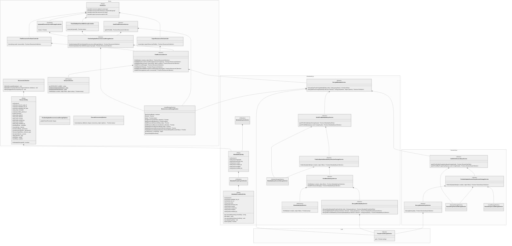

```mermaid
%%{init: {'theme':'neutral'}}%%
classDiagram
    namespace Event {
        class ResourcesCollection {
            +filterByDecryptedMetadata() void
            +filterByResourceTypes(ResourceTypesCollection collection) void
            +filterBySuggestResources(string url) void
        }

        class ResourceEntity {
            <<Entity>>
            -uuid props.id
            -uuid props.resource_type_id
            -uuid props.metadata_key_id
            -uuid props.metadata_key_type
            -string props.metadata
            -uuid props.folder_parent_id
            -boolean personal
            -string props.expired
            -string props.deleted
            -string props.created
            -string props.created_by
            -string props.modified
            -string props.modified_by
            -MetadataEntity _metadata
            -FavoriteEntity _favorite
            -PermissionEntity _permission
            -PermissionsCollection _permissions
            -ResourceTypeEntity _resource_type
            -SecretsCollection _secrets
            -TagsCollection _tags
            -UserEntity _creator
            -UserEntity _modifier
            +isMetadataDecrypted() boolean
        }

        class EventsList{
            <<Event>>
            "passbolt.resources.update-local-storage"
            "passbolt.resources.find-all-ids-by-is-shared-with-group"
            "passbolt.share.find-resources-for-share"
            "passbolt.export-resources.export-to-file"
        }

        class UpdateAllResourcesLocalStorageController{
            <<Controller>>
            +exec() Promise
        }

        class FindAllIdsByIsSharedWithGroupController{
            +exec(uuid groupId) Promise~array~
        }

        class FindResourcesForShareController{
            +exec(Array~uuid~ resourceIds) Promise~ResourcesCollection~
        }

        class ExportResourcesFileController {
            +exec(object exportResourcesFileDto) Promise~ResourcesCollection~
        }

        class GetOrFindResourcesService{
            <<Service>>
            +getOrFindAll() Promise~ResourcesCollection~
        }

        class FindAndUpdateResourcesLocalStorageService{
            <<Service>>
            +findAndUpdateAll(FindAndUpdateResourcesLocalStorageOptions) Promise~ResourcesCollection~
            +findAndUpdateByIsSharedWithGroup(uuid groupId) Promise~ResourcesCollection~
        }

        class FindAndUpdateResourcesLocalStorageOptions {
            updatePeriodThreshold: integer
        }

        class FindResourcesService{
            <<Service>>
            +findAll(object contains, object filters) Promise~ResourcesCollection~
            +findAllByHasAccessForLocalStorage(uuid acoForeignKey) Promise~ResourcesCollection~
            +findAllByIds(Array~uuid~ resourcesIds, object contains) Promise~ResourcesCollection~
            +findAllForLocalStorage() Promise~ResourcesCollection~
            +findAllByIdsForShare() Promise~ResourcesCollection~
            +findAllByIsSharedWithGroupForLocalStorage(uuid groupId) Promise~ResourcesCollection~
            +findAllForDecrypt(array~uuid~ resourceIds) Promise~ResourcesCollection~
        }

        class ExecuteConcurrentlyService {
            +execute(array callbacks, integer concurrency, object options): Promise~array~
        }

        class ResourcesLocalStorageService {
            <<LocalStorageService>>
            $hasCachedData() boolean
            $flush() Promise
            $get() Promise~array~
            $set(ResourcesCollection collection) Promise
            $getResourceById(uuid id) Promise~object~
            $addResource(ResourceEntity entity) Promise
            $addResources(ResourcesCollection collection) Promise
            $updateResource(ResourceEntity entity) Promise
            $updateResources(ResourcesCollection collection) Promise
            $updateResourcesExpiryDate(array~PasswordExpiryResourceEntity~) Promise
            get $DEFAULT_CONTAIN() object
            $assertEntityBeforeSave()
        }

        class ResourceService {
            <<APIService>>
            +get RESOURCE_NAME() string
            +getSupportedContainOptions() array$
            +getSupportedFilterOptions() array$
            +findAll(object contains, object filters, object orders) Promise~array~
        }
    }

    namespace MetadataKeys {
        class MetadataKeysCollection {
            <<Collection>>
        }

        class MetadataKeyEntity {
            <<Entity>>
            +uuid props.id
            +string props.fingerprint
            +string props.armored_key
            +string props.created
            +string props.created_by
            +string props.modified
            +string props.modified_by
        }

        class MetadataPrivateKeysCollection {
            <<Collection>>
        }

        class MetadataPrivateKeyEntity {
            <<Entity>>
            +uuid props.id
            +uuid props.metadata_key_id
            +uuid props.user_id
            +string props.data
            +string props.armored_key
            +string props.created
            +string props.created_by
            +string props.modified
            +string props.modified_by
            +get armoredKey(string armordKey) string
            +get data() string
            +set armoredKey(string armordKey) void
            +set data(string data) void
            +isDecrypted() boolean
        }

        class DecryptMetadataService {
            <<Service>>
            +decryptOneFromForeignModel(Entity entity, ?string passphrase) Promise~Entity~
            +decryptAllFromForeignModels(Collection collection, ?string passphrase, ?object options) Promise~Collection~
        }

        class GetOrFindMetadataKeysService{
            <<Service>>
            +getOrFindOneById(uuid foreignKeyId) Promise~MetadataKeyEntity~
            +getOrFindAllByIds(array~uuid~ foreignKeyIds) Promise~MetadataKeysCollection~
        }

        class FindAndUpdateMetadataKeysSessionStorageService{
            <<Service>>
            +findAndUpdateAll(object contains, object filters) Promise~MetadataKeysCollection~
        }

        class FindMetadataKeysService{
            <<Service>>
            +findAll(object contains, object filters) Promise~MetadataKeysCollection~
            +findAllForSessionStorage() Promise~MetadataKeysCollection~
        }

        class DecryptMetadataKeyService{
            <<Service>>
            +decryptOne(MetadataPrivateKeyEntity entity, ?string passphrase) Promise~MetadataPrivateKeyEntity~
            +decryptAll(MetadataPrivateKeysCollection collection, ?string passphrase) Promise~MetadataPrivateKeysCollection~
            +decryptAllFromMetdataKeysCollection(MetadataKeysCollection collection, ?string passphrase) Promise~MetadataKeysCollection~
        }

        class MetadataKeysSessionStorageService {
            <<SessionStorageService>>
        }

        class MetadataKeyApiService {
            <<APIService>>
            +findAll(object contains, object filters) Promise~array~
        }
    }

    namespace SessionKeys {
        class GetOrFindSessionKeysService{
            <<Service>>
            +getOrFindOneByForeignKeyId(uuid foreignKeyId) Promise~SessionKeyEntity~
            +getOrFindAllByForeignKeyIds(array~uuid~ foreignKeyIds) Promise~SessionKeysCollection~
        }

        class FindAndUpdateSessionKeysSessionStorageService{
            <<Service>>
            +findAndUpdateAll(object contains, object filters) Promise~SessionKeysCollection~
        }

        class DecryptSessionKeysService{
            <<Service>>
            +decrypt(string data) Promis~SessionsKeysCollection~
        }

        class SessionKeysSessionStorageService {
            <<SessionStorageService>>
        }

        class SessionKeysLocalStorageService {
            <<LocalStorageService>>
        }
    }

    namespace Auth {
        class PassphraseStorageService {
            <<Service>>
            get() Promise~string~
        }
    }

    %% Resource relationships
    ResourcesCollection*--ResourceEntity
    ResourceEntity*--MetadataKeyEntity
    EventsList*--UpdateAllResourcesLocalStorageController
    EventsList*--FindAllIdsByIsSharedWithGroupController
    EventsList*--FindResourcesForShareController
    EventsList*--ExportResourcesFileController
    UpdateAllResourcesLocalStorageController*--FindAndUpdateResourcesLocalStorageService
    FindAllIdsByIsSharedWithGroupController*--FindAndUpdateResourcesLocalStorageService
    FindResourcesForShareController*--FindResourcesService
    FindAndUpdateResourcesLocalStorageService*--ResourcesLocalStorageService
    ExportResourcesFileController*--FindResourcesService
    GetOrFindResourcesService*--ResourcesLocalStorageService
    GetOrFindResourcesService*--FindAndUpdateResourcesLocalStorageService
    FindAndUpdateResourcesLocalStorageService*--FindResourcesService
    FindResourcesService*--ResourceService
    %% Metadata key relationships
    MetadataKeysCollection*--MetadataKeyEntity
    MetadataKeyEntity*--MetadataPrivateKeysCollection
    MetadataPrivateKeysCollection*--MetadataPrivateKeyEntity
    FindResourcesService*--DecryptMetadataService
    DecryptMetadataService*--GetOrFindSessionKeysService
    DecryptMetadataService*--GetOrFindMetadataKeysService
    DecryptMetadataService*--ResourcesLocalStorageService
    DecryptMetadataService*--PassphraseStorageService
    GetOrFindMetadataKeysService*--MetadataKeysSessionStorageService
    GetOrFindMetadataKeysService*--FindAndUpdateMetadataKeysSessionStorageService
    FindAndUpdateMetadataKeysSessionStorageService*--FindMetadataKeysService
    FindAndUpdateMetadataKeysSessionStorageService*--MetadataKeysSessionStorageService
    FindMetadataKeysService*--DecryptMetadataKeyService
    DecryptMetadataKeyService*--PassphraseStorageService
    FindMetadataKeysService*--MetadataKeyApiService
    %% Session key relationships
    GetOrFindSessionKeysService*--SessionKeysSessionStorageService
    GetOrFindSessionKeysService*--FindAndUpdateSessionKeysSessionStorageService
    FindAndUpdateSessionKeysSessionStorageService*--SessionKeysLocalStorageService
    FindAndUpdateSessionKeysSessionStorageService*--SessionKeysSessionStorageService
    FindAndUpdateSessionKeysSessionStorageService*--DecryptSessionKeysService
    DecryptSessionKeysService*--PassphraseStorageService
```