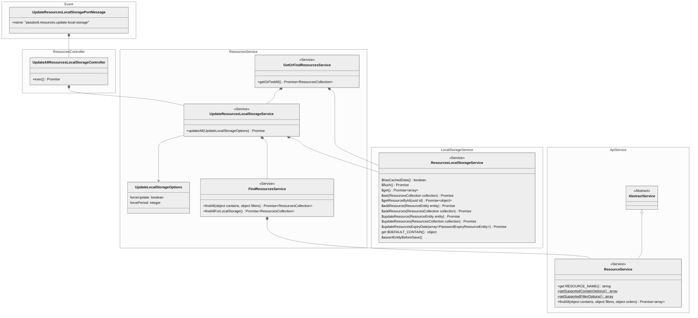

```mermaid
%%{init: {'theme':'neutral'}}%%
classDiagram
    namespace Event {
        class UpdateResourcesLocalStoragePortMessage{
            +name: "passbolt.resources.update-local-storage"
        }
    }

    namespace ResourcesController {
        class UpdateAllResourcesLocalStorageController{
            +exec() Promise
        }
    }

    namespace ResourcesService{
        class GetOrFindResourcesService{
            <<Service>>
            +getOrFindAll() Promise~ResourcesCollection~
        }

        class UpdateResourcesLocalStorageService{
            <<Service>>
            +updateAll(UpdateLocalStorageOptions) Promise
        }

        class UpdateLocalStorageOptions {
            forceUpdate: boolean
            forcePeriod: integer
        }

        class FindResourcesService{
            <<Service>>
            +findAll(object contains, object filters) Promise~ResourcesCollection~
            +findAllForLocalStorage() Promise~ResourcesCollection~
        }
    }

    namespace ApiService{
        class AbstractService {
            <<Abstract>>
        }

        class ResourceService {
            <<Service>>
            +get RESOURCE_NAME() string
            +getSupportedContainOptions() array$
            +getSupportedFilterOptions() array$
            +findAll(object contains, object filters, object orders) Promise~array~
        }
    }

    namespace LocalStorageService{
        class ResourcesLocalStorageService {
            <<Service>>
            $hasCachedData() boolean
            $flush() Promise
            $get() Promise~array~
            $set(ResourcesCollection collection) Promise
            $getResourceById(uuid id) Promise~object~
            $addResource(ResourceEntity entity) Promise
            $addResources(ResourcesCollection collection) Promise
            $updateResource(ResourceEntity entity) Promise
            $updateResources(ResourcesCollection collection) Promise
            $updateResourcesExpiryDate(array~PasswordExpiryResourceEntity~) Promise
            get $DEFAULT_CONTAIN() object
            $assertEntityBeforeSave()
        }
    }

    UpdateResourcesLocalStoragePortMessage*--UpdateAllResourcesLocalStorageController
    UpdateAllResourcesLocalStorageController*--UpdateResourcesLocalStorageService
    UpdateResourcesLocalStorageService*--ResourcesLocalStorageService
    UpdateResourcesLocalStorageService-->UpdateLocalStorageOptions
    GetOrFindResourcesService*--ResourcesLocalStorageService
    GetOrFindResourcesService*--UpdateResourcesLocalStorageService
    UpdateResourcesLocalStorageService*--FindResourcesService
    FindResourcesService*--ResourceService
    AbstractService<|--ResourceService
```
