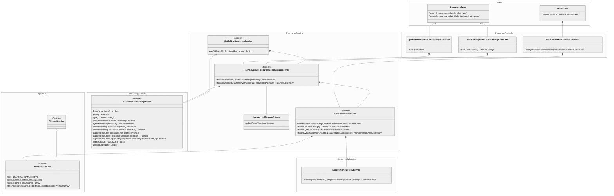

```mermaid
%%{init: {'theme':'neutral'}}%%
classDiagram
    namespace Event {
        class ResourcesEvent{
            "passbolt.resources.update-local-storage"
            "passbolt.resources.find-all-ids-by-is-shared-with-group"
        }

        class ShareEvent{
            "passbolt.share.find-resources-for-share"
        }
    }

    namespace ResourcesController {
        class UpdateAllResourcesLocalStorageController{
            +exec() Promise
        }

        class FindAllIdsByIsSharedWithGroupController{
            +exec(uuid groupId) Promise~array~
        }

        class FindResourcesForShareController{
            +exec(Array~uuid~ resourceIds) Promise~ResourcesCollection~
        }
    }

    namespace ResourcesService{
        class GetOrFindResourcesService{
            <<Service>>
            +getOrFindAll() Promise~ResourcesCollection~
        }

        class FindAndUpdateResourcesLocalStorageService{
            <<Service>>
            +findAndUpdateAll(UpdateLocalStorageOptions) Promise~void~
            +findAndUpdateByIsSharedWithGroup(uuid groupId) Promise~ResourcesCollection~
        }

        class UpdateLocalStorageOptions {
            updatePeriodThreshold: integer
        }

        class FindResourcesService{
            <<Service>>
            +findAll(object contains, object filters) Promise~ResourcesCollection~
            +findAllForLocalStorage() Promise~ResourcesCollection~
            +findAllByIdsForShare() Promise~ResourcesCollection~
            +findAllByIsSharedWithGroupForLocalStorage(uuid groupId) Promise~ResourcesCollection~
        }
    }
    namespace ConcurrentlyService {
        class ExecuteConcurrentlyService {
            +execute(array callbacks, integer concurrency, object options): Promise~array~
        }
    }
    namespace ApiService{
        class AbstractService {
            <<Abstract>>
        }

        class ResourceService {
            <<Service>>
            +get RESOURCE_NAME() string
            +getSupportedContainOptions() array$
            +getSupportedFilterOptions() array$
            +findAll(object contains, object filters, object orders) Promise~array~
        }
    }

    namespace LocalStorageService{
        class ResourcesLocalStorageService {
            <<Service>>
            $hasCachedData() boolean
            $flush() Promise
            $get() Promise~array~
            $set(ResourcesCollection collection) Promise
            $getResourceById(uuid id) Promise~object~
            $addResource(ResourceEntity entity) Promise
            $addResources(ResourcesCollection collection) Promise
            $updateResource(ResourceEntity entity) Promise
            $updateResources(ResourcesCollection collection) Promise
            $updateResourcesExpiryDate(array~PasswordExpiryResourceEntity~) Promise
            get $DEFAULT_CONTAIN() object
            $assertEntityBeforeSave()
        }
    }

    %% Event relationships
    ResourcesEvent*--UpdateAllResourcesLocalStorageController
    ResourcesEvent*--FindAllIdsByIsSharedWithGroupController
    ShareEvent*--FindResourcesForShareController
    %% Controller relationships
    UpdateAllResourcesLocalStorageController*--FindAndUpdateResourcesLocalStorageService
    FindAllIdsByIsSharedWithGroupController*--FindAndUpdateResourcesLocalStorageService
    FindResourcesForShareController*--FindResourcesService
    %% Business service relationships
    FindAndUpdateResourcesLocalStorageService*--ResourcesLocalStorageService
    FindAndUpdateResourcesLocalStorageService-->UpdateLocalStorageOptions
    GetOrFindResourcesService*--ResourcesLocalStorageService
    GetOrFindResourcesService*--FindAndUpdateResourcesLocalStorageService
    FindAndUpdateResourcesLocalStorageService*--FindResourcesService
    FindResourcesService*--ResourceService
    FindResourcesService*--ExecuteConcurrentlyService
    %% API service relationships
    AbstractService<|--ResourceService
```
