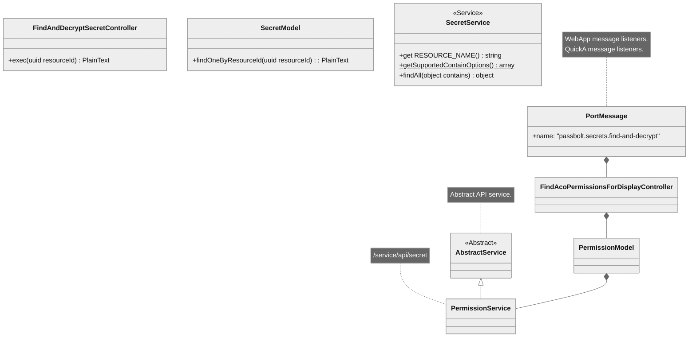

```mermaid
%%{init: {'theme':'neutral'}}%%
classDiagram
    note for PortMessage "WebApp message listeners.<br>QuickA message listeners."
    class PortMessage{
        +name: "passbolt.secrets.find-and-decrypt"
    }

    class FindAndDecryptSecretController{
        +exec(uuid resourceId) PlainText
    }

    class SecretModel{
        +findOneByResourceId(uuid resourceId): PlainText
    }

    note for PermissionService "/service/api/secret"
    class SecretService {
        <<Service>>
        +get RESOURCE_NAME() string
        +getSupportedContainOptions() array$
        +findAll(object contains) object
    }

    note for AbstractService "Abstract API service."
    class AbstractService {
        <<Abstract>>
    }

    AbstractService<|--PermissionService
    PermissionModel*--PermissionService
    FindAcoPermissionsForDisplayController*--PermissionModel
    PortMessage*--FindAcoPermissionsForDisplayController
```
