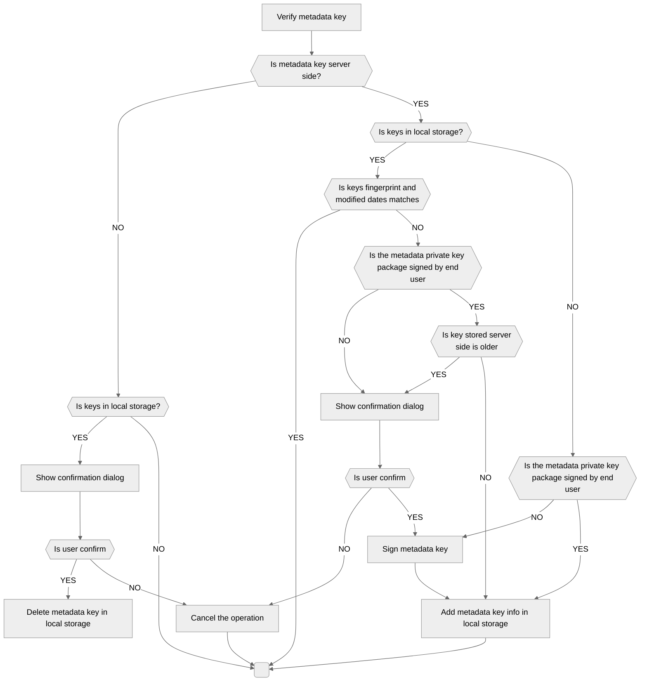

```mermaid
%%{init: {'theme':'neutral'}}%%
flowchart TD

    METADATA_KEY_VERIFYING[Verify metadata key]
    IS_METADATA_KEY_SERVER_SIDE{{Is metadata key server side?}}
    IS_KEYS_LOCAL_STORAGE{{Is keys in local storage?}}
    IS_KEYS_LOCAL_STORAGE_WITH_NO_KEYS_SERVER_SIDE{{Is keys in local storage?}}
    IS_METADATA_PRIVATE_KEY_SIGNED{{Is the metadata private key <br> package signed by end user}}
    IS_KEY_SIGNED{{Is the metadata private key <br> package signed by end user}}
    IS_KEY_SERVER_SIDE_OLDER{{Is key stored server <br> side is older}}
    SIGN_METADATA_KEY[Sign metadata key]
    ADD_METADATA_KEY_LOCAL_STORAGE[Add metadata key info in local storage]
    DELETE_METADATA_KEY_LOCAL_STORAGE[Delete metadata key in local storage]
    IS_METADATA_KEY_MATCHES{{Is keys fingerprint and <br> modified dates matches}}
    SHOW_CONFIRMATION_DIALOG[Show confirmation dialog]
    SHOW_CONFIRMATION_DIALOG_DELETE_KEY[Show confirmation dialog]
    IS_USER_CONFIRM{{Is user confirm}}
    IS_USER_CONFIRM_DELETE{{Is user confirm}}
    CANCEL[Cancel the operation]

    METADATA_KEY_VERIFYING --> IS_METADATA_KEY_SERVER_SIDE
    IS_METADATA_KEY_SERVER_SIDE --> |NO|IS_KEYS_LOCAL_STORAGE_WITH_NO_KEYS_SERVER_SIDE
    IS_METADATA_KEY_SERVER_SIDE --> |YES|IS_KEYS_LOCAL_STORAGE
    IS_KEYS_LOCAL_STORAGE --> |YES|IS_METADATA_KEY_MATCHES
    IS_KEYS_LOCAL_STORAGE --> |NO|IS_METADATA_PRIVATE_KEY_SIGNED
    IS_METADATA_KEY_MATCHES --> |YES|END( )
IS_METADATA_KEY_MATCHES --> |NO|IS_KEY_SIGNED
IS_METADATA_PRIVATE_KEY_SIGNED --> |NO|SIGN_METADATA_KEY
IS_METADATA_PRIVATE_KEY_SIGNED --> |YES|ADD_METADATA_KEY_LOCAL_STORAGE
IS_KEY_SIGNED --> |NO|SHOW_CONFIRMATION_DIALOG
IS_KEY_SIGNED --> |YES|IS_KEY_SERVER_SIDE_OLDER
IS_KEY_SERVER_SIDE_OLDER --> |YES|SHOW_CONFIRMATION_DIALOG
IS_KEY_SERVER_SIDE_OLDER --> |NO|ADD_METADATA_KEY_LOCAL_STORAGE
SIGN_METADATA_KEY --> ADD_METADATA_KEY_LOCAL_STORAGE
IS_KEYS_LOCAL_STORAGE_WITH_NO_KEYS_SERVER_SIDE --> |YES|SHOW_CONFIRMATION_DIALOG_DELETE_KEY
IS_KEYS_LOCAL_STORAGE_WITH_NO_KEYS_SERVER_SIDE --> |NO|END( )
ADD_METADATA_KEY_LOCAL_STORAGE --> END( )
SHOW_CONFIRMATION_DIALOG --> IS_USER_CONFIRM
SHOW_CONFIRMATION_DIALOG_DELETE_KEY --> IS_USER_CONFIRM_DELETE
IS_USER_CONFIRM_DELETE --> |YES|DELETE_METADATA_KEY_LOCAL_STORAGE
IS_USER_CONFIRM_DELETE --> |NO|CANCEL
IS_USER_CONFIRM --> |NO|CANCEL
IS_USER_CONFIRM --> |YES|SIGN_METADATA_KEY
CANCEL -->END( )


```