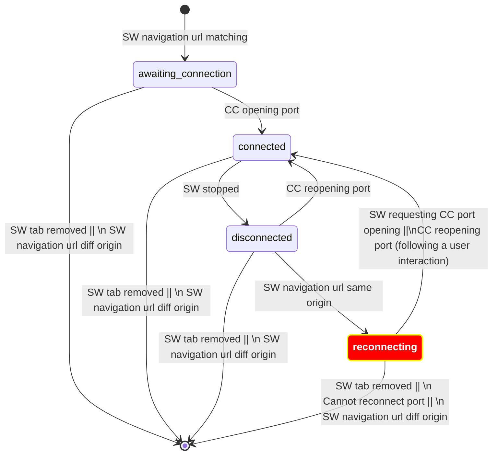

```mermaid
stateDiagram
    classDef badBadEvent fill:#f00,color:white,font-weight:bold,stroke-width:2px,stroke:yellow

    [*] --> awaiting_connection: SW navigation url matching

    awaiting_connection --> connected: CC opening port
    connected --> disconnected: SW stopped
    disconnected --> reconnecting: SW navigation url same origin
    disconnected --> connected: CC reopening port
    reconnecting --> connected: SW requesting CC port opening ||\nCC reopening port (following a user interaction)

    awaiting_connection --> [*]: SW tab removed || \n SW navigation url diff origin
    connected --> [*]: SW tab removed || \n SW navigation url diff origin
    disconnected --> [*]: SW tab removed || \n SW navigation url diff origin
    reconnecting --> [*]: SW tab removed || \n Cannot reconnect port || \n SW navigation url diff origin

    class reconnecting badBadEvent
```
